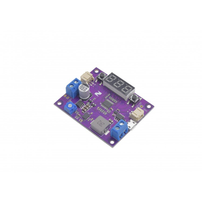

# Zio DC-DC Booster

> This product can be available for purchase [here](https://www.smart-prototyping.com/Zio-DC-DC-Booster).

#### Description

The Zio DC-DC is an adjustable voltage booster that can take a 3.7v to 10v input and boost any higher voltage between 5v and 12.5v.

The board features four connectors (one set of screw terminals, two JST PH connectors, and a micro-USB connector) on the input bus, and a set of screw terminals and PTH pads for the output.

Output voltage is adjusted using a potentiometer that can be adjusted with a Phillips or 2mm flathead screwdriver. The 24-segment (3 seven-segment digits and three decimal indicators) display can be toggled using a momentary switch to show the input voltage or output voltage, and a second momentary switch toggles the output on and off.

> Note: This board can only boost, and doesn’t have the ability to regulate the input to lower voltage.

#### Specification

* Booster IC: TPS61088
* Input: 3.7v to 10v
* Output: 5v to 12.5v
* Dimension: 46.8x 56.7mm
* Weight: 20.7g

#### Links

* [Eagle and Schematic file](https://github.com/ZIOCC/Zio-DC-DC-Booster)
* [TPS61088 Datasheet](http://www.ti.com/product/TPS61088/technicaldocuments)
* [Firmware for STM8](https://www.smart-prototyping.com/image/data/NOA-RnD/101917%20DC-DC%20Booster/Zio%20DC-DC%20Booster_firmware.zip)

> ###### About Zio
> Zio is a new line of open sourced, compact, and grid layout boards, fully integrated for Arduino and Qwiic ecosystem. Designed ideally for wearables, robotics, small-space limitations or other on the go projects. Check out other awesome Zio products [here](https://www.smart-prototyping.com/Zio).
